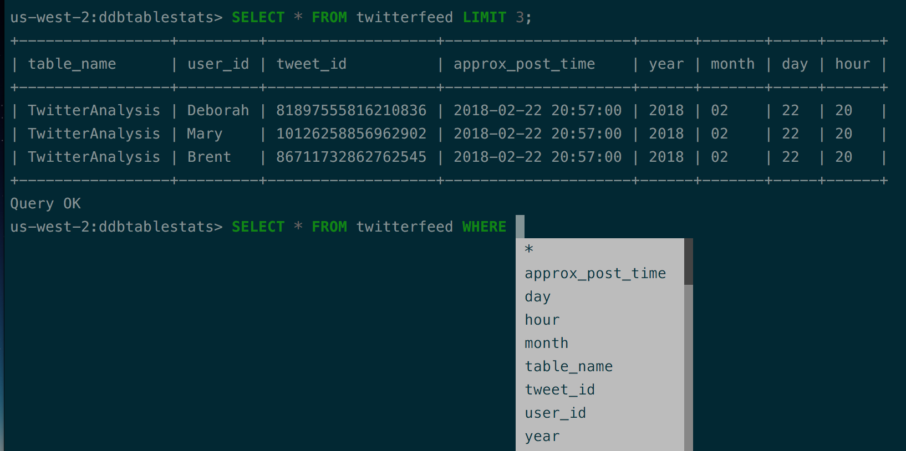

**NOTE** I only tested it on Python 3.7

# Introduction

AthenaCLI is a command line client for [Athena](https://aws.amazon.com/athena/) service that can do auto-completion and syntax highlighting.



# Quick Start

## Install

``` bash
$ git clone https://github.com/dbcli/athenacli.git
$ # use pipenv or virtualenv create a virtual environment
$ pip install -e .
```

## Config

A config file is automatically created at ~/.athenacli/athenaclirc at first launch. See the file itself for a description of all available options.

Below 3 arguments are required.

``` text
# AWS credentials
aws_access_key_id = ''
aws_secret_access_key = ''

# Amazon S3 staging directory where query results will be stored.
s3_staging_dir = ''
```

## Create a table

``` bash
$ athenacli -e examples/create_table.sql
```

## Run a query

``` bash
$ athenacli -e 'select elb_name, request_ip from elb_logs LIMIT 10'
```

# Features

- Auto-completion as you type for SQL keywords as well as tables, views and columns in the database.
- Syntax highlighting using Pygments.
- Smart-completion (enabled by default) will suggest context-sensitive completion.
    - `SELECT * FROM`  will only show table names.
    - `SELECT * FROM users WHERE`  will only show column names.
- Config file is automatically created at ~/.athenacli/athenaclirc at first launch.
- Pretty prints tabular data.

# Todo

- [ ] support the special commands.
- [ ] go through the config file and toggle the various config values.
- [ ] add unit tests.
- [ ] make it public.

# Why did you create this?

- Have fun!
- The most important features are auto-completion/auto-suggestion (you don't need to hit Tab to trigger it) and syntax highlighting.
- Athena console is a very cool application, but in order to run an ad-hoc query in Athena console you need to open AWS console, search for Athena and/or click it, choose the correct database, and then type your query.
- If you use multiple AWS account, then you've probably met "You must first log out before logging into a different AWS account" before, it's a little bit annoying sometimes.

# Credits

A special thanks to [Amjith Ramanujam](https://github.com/amjith) for creating pgcli and mycli, which inspired me to create this AthenaCLI, and AthenaCLI is created based on a clone of mycli.

Thanks to [Jonathan Slenders](https://github.com/jonathanslenders) for creating Python Prompt Toolkit, which leads me to pgcli and mycli. It's a lot of fun playing with this library.

Thanks to [PyAthena](https://github.com/laughingman7743/PyAthena) for a pure python adapter to Athena database.

Last but not least, thanks my team and manager encourage me to work on this hobby project.