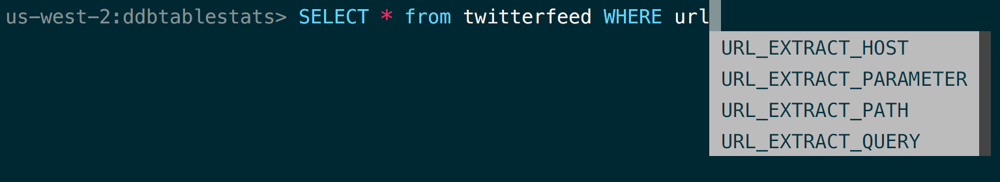
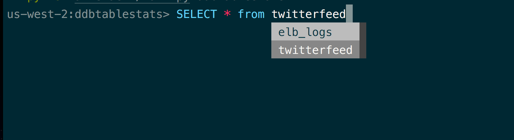
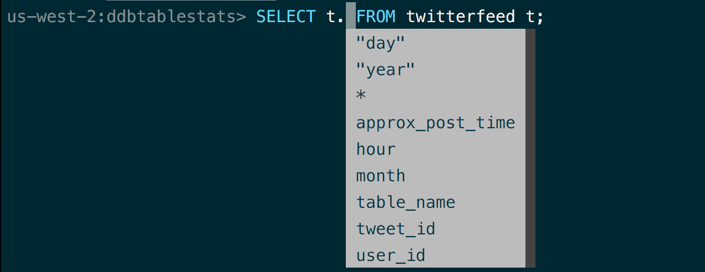
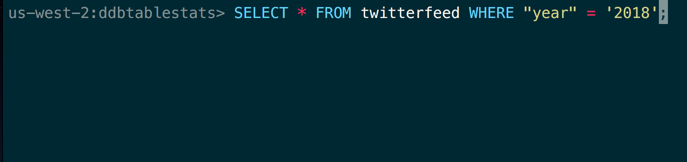
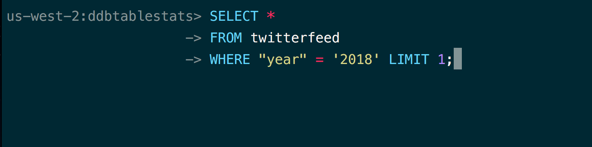
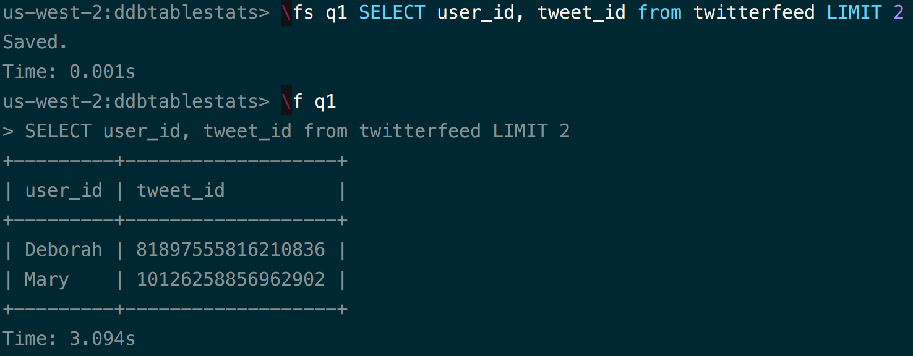
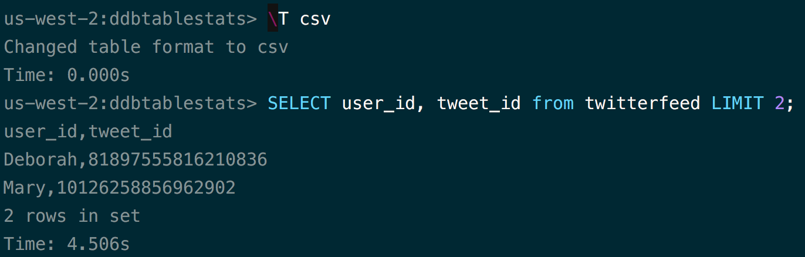

Features
============

Auto completion
-----------------

Simple completions such as keywords and sql-functions.

Smart completion
-----------------

Smart completion will suggest context-sensitive completion.

Alias support
---------------

Column completions will work even when table names are aliased.

Syntax highlighting
---------------------

Syntax highlighting for sql.

Multiline queries
--------------------

Support for multiline queries.

Pager
----------

Output of an sql command is automatically piped through less command.

Favorite queries
--------------------

Save a query using \fs alias query and execute it with \f alias whenever you need.

Various table format
----------------------

Support various table format, e.g. ascii, csv, html etc.

