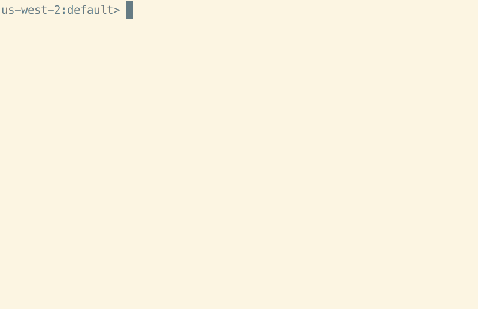

AthenaCLI
==========

AthenaCLI is a command line interface (CLI) for `Athena <https://aws.amazon.com/athena/>`_ service that can do auto-completion and syntax highlighting, and is a proud member of the dbcli community.

* Source: https://github.com/dbcli/athenacli

Quick Start
=============

Install
-------------

.. code-block:: bash

    $ pip install athenacli

You can refer to :doc:`../install` page for more options.

Config
------------

A config file is automatically created at ~/.athenacli/athenaclirc at first launch (run `athenacli`). See the file itself for a description of all available options.

Below 4 variables are required.

.. code-block:: text

    # If you are a user of aws cli, you might want to use some configurations of aws cli,
    # please refer to https://athenacli.readthedocs.io/en/latest/awsconfig.html for more infomation.
    aws_access_key_id = ''
    aws_secret_access_key = ''
    region = '' # e.g us-west-2, us-east-1

    # Amazon S3 staging directory where query results are stored.
    # NOTE: S3 should in the same region as specified above.
    # The format is 's3://<your s3 directory path>'
    s3_staging_dir = ''

    # Name of athena workgroup that you want to use
    work_group = '' # e.g. primary

Create a table
---------------

.. code-block:: bash

    $ athenacli -e examples/create_table.sql

You can find `examples/create_table.sql` `here <https://github.com/dbcli/athenacli/blob/master/examples/create_table.sql>`_.

Run a query
--------------

.. code-block:: bash

    $ athenacli -e 'select elb_name, request_ip from elb_logs LIMIT 10'

REPL
-------------

.. code-block:: bash

    $ athenacli [<database_name>]

Table of Contents
-----------------

.. toctree::

   features
   install
   awsconfig
   usage
   develop
   faq
